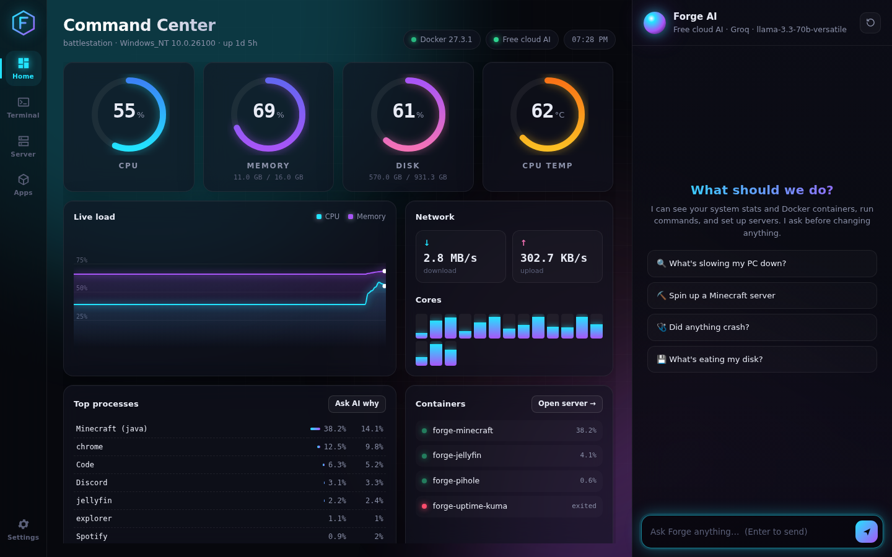
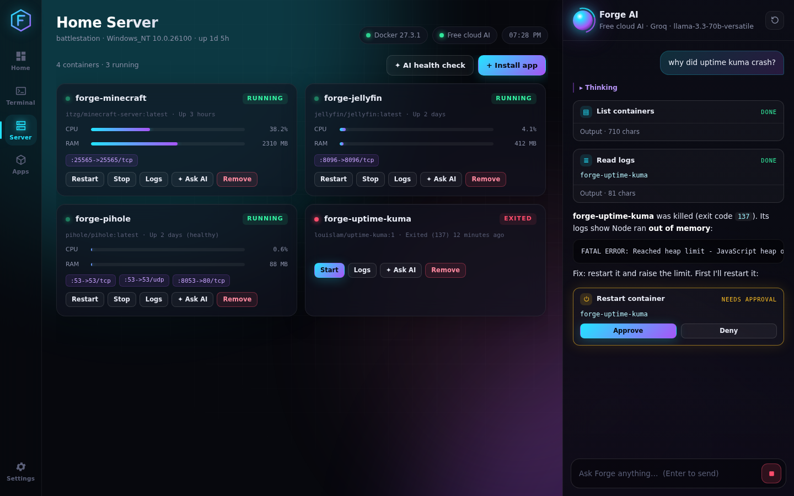
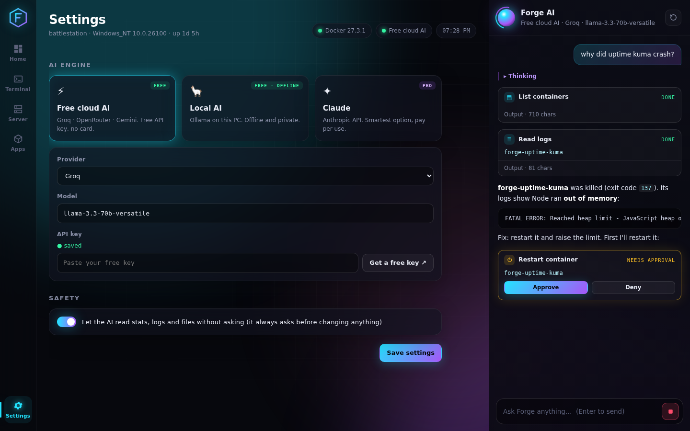

# Forge

**An AI-powered command center for your computer and home server.** Real terminals, a Docker home-server panel with one-click apps, live system stats, and an AI agent that can see and control all of it. It always asks before changing anything.



## What it does

| | |
|---|---|
| **Command Center** | Live CPU / RAM / disk / temperature gauges, a streaming load chart, per-core heatmap, network speed, top processes |
| **Terminal** | Real shell tabs (PowerShell on Windows, your `$SHELL` on Mac/Linux) |
| **Home Server** | Every Docker container with live CPU/RAM, ports, logs, start / stop / restart / remove |
| **App Store** | One-click installs: Minecraft server, Jellyfin, Pi-hole, Uptime Kuma, Home Assistant, VS Code Server, Ollama, Nextcloud |
| **Forge AI** | Chat with an agent that reads your stats, containers and logs, runs commands and installs apps. Every change shows an **Approve / Deny** card first |

Try asking it:

- *"What's slowing my PC down?"*
- *"Set up a Minecraft server with 4GB of RAM."*
- *"Why did my Jellyfin container crash?"*
- *"What's eating my disk space?"*



## Pick your AI engine (Settings)



| Engine | Cost | Setup |
|---|---|---|
| **Free cloud AI** (default) | Free | Get a free key from [Groq](https://console.groq.com/keys), [OpenRouter](https://openrouter.ai/keys) or [Google Gemini](https://aistudio.google.com/apikey) and paste it in Settings. No credit card needed. Free tiers have rate limits. |
| **Local AI** | Free, offline | Install [Ollama](https://ollama.com/download) (or one-click it in the App Store), then run `ollama pull qwen3:8b`. Everything stays on your PC. Needs a decent GPU or a lot of RAM for good speed. |
| **Claude** | Pay per use | Paste an [Anthropic API key](https://console.anthropic.com/settings/keys). This is the smartest and most reliable option for multi-step jobs. Uses Claude Opus 5 by default, or Sonnet 5 if you want cheaper. |

API keys are encrypted with your OS keychain (Windows DPAPI, macOS Keychain, libsecret on Linux) and never shown to the UI.

## Run it

You need [Node.js 20+](https://nodejs.org). For the Home Server features you also need [Docker Desktop](https://www.docker.com/products/docker-desktop/) (Windows/Mac) or Docker Engine (Linux).

```bash
npm install
npm start
```

Linux only: if `npm install` can't find a prebuilt terminal module, install build tools first (`sudo apt install build-essential python3`).

Build an installer (`.exe` / `.dmg` / `.AppImage`) for your OS:

```bash
npm run dist
```

## Tests

```bash
npm test
```

Covers the tool approval gate, input validation, both AI engines end-to-end against fake streaming servers, Docker config generation, key encryption, and the chat markdown sanitizer.

## How it's built

```
src/
  main/              Electron main process (Node)
    main.js          window + IPC
    agent/
      index.js       routes chat to the chosen engine, brokers approvals
      claude.js      Claude via the Anthropic SDK (streaming tool loop)
      openai-compat.js  Groq / OpenRouter / Gemini / Ollama (OpenAI-compatible API)
      tools.js       what the AI can do: run_command, system_stats, list_containers,
                     container_logs, container_action, install_app, read_file
    docker.js        Docker Engine API (dockerode)
    catalog.js       one-click app definitions
    stats.js         system stats (systeminformation)
    pty.js           terminals (node-pty)
    settings.js      settings + encrypted keys
  preload.js         the only bridge between UI and system (contextIsolation + sandbox)
  renderer/          UI: plain HTML/CSS/JS + xterm.js
```

## Safety

- The AI **can't change anything without your click**: running commands, starting, stopping or removing containers, and installing apps all need approval. Reading stats, logs and files is automatic by default; you can turn that off in Settings.
- Removing a container keeps its data volumes.
- The UI runs sandboxed, with no Node access, and talks to the system only through a small, fixed API.
